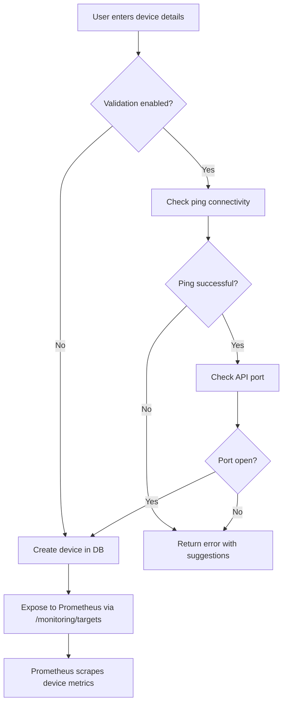
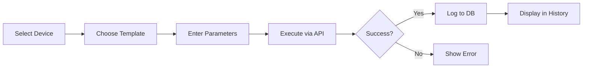
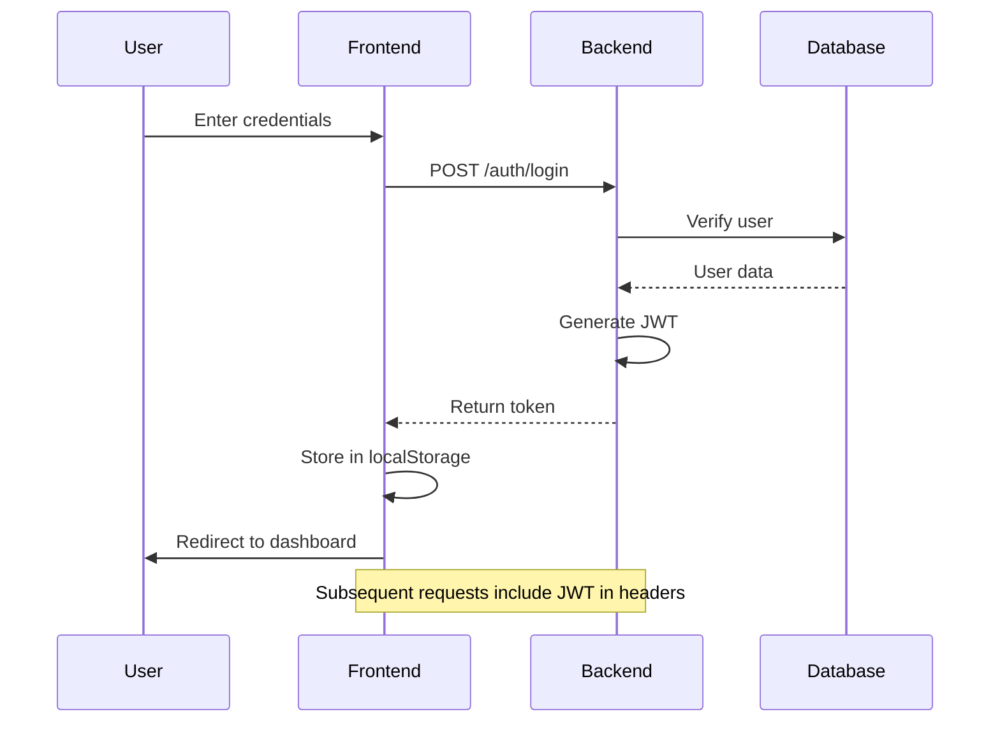

# NetworkWeaver - Methodology Documentation

## 1. System Development Methodology

### 1.1 Architecture Approach
NetworkWeaver follows a **microservices architecture** pattern using Docker containerization for modularity, scalability, and ease of deployment.

#### Design Principles
- **Separation of Concerns**: Frontend, backend, monitoring, and database are independent services
- **API-First Design**: RESTful API with OpenAPI documentation
- **Containerization**: All services run in Docker containers
- **Service Discovery**: Dynamic device registration and Prometheus auto-configuration
- **Stateless Backend**: JWT-based authentication for horizontal scalability

### 1.2 Technology Stack Rationale

| Layer | Technology | Justification |
|-------|-----------|---------------|
| **Frontend** | React + Vite | Modern, fast development with HMR |
| **Backend** | FastAPI | High performance, async support, auto-docs |
| **Database** | PostgreSQL | ACID compliance, mature ecosystem |
| **Monitoring** | Prometheus + Grafana | Industry standard for metrics |
| **VPN** | WireGuard | Modern, lightweight, secure |

---

## 2. Device Management Methodology

### 2.1 Device Registration Flow



### 2.2 Device Types & Monitoring Methods

| Device Type | Protocol | Exporter | Configuration |
|-------------|----------|----------|---------------|
| **MikroTik Router** | SNMP | SNMP Exporter | Enable SNMP on device |
| **Windows PC** | HTTP | Windows Exporter | Install exporter on host |
| **Linux Server** | HTTP | Node Exporter | Install exporter on host |
| **Generic SNMP** | SNMP | SNMP Exporter | Configure SNMP community |

### 2.3 Device Status Monitoring

**Methodology**: Periodic ICMP ping checks every 30 seconds

```python
# Backend: monitoring.py
def check_ping(host: str, timeout: int = 1) -> bool:
    # Cross-platform ping implementation
    # Returns True if host is reachable
```

**Alert Triggers**:
- Device DOWN → Red alert in dashboard
- Sidebar notification badge appears
- Device list shows DOWN status

---

## 3. Monitoring Architecture

### 3.1 Metrics Collection Flow

```
┌─────────────┐     SNMP/161    ┌──────────────┐
│  MikroTik   │◄────────────────│ SNMP Exporter│
│   Router    │                 │  (Docker)    │
└─────────────┘                 └──────┬───────┘
                                       │ HTTP/9116
┌─────────────┐  HTTP/9182     ┌──────▼───────┐
│   Windows   │────────────────│  Prometheus  │
│   Laptop    │                │  (Scraper)   │
└─────────────┘                └──────┬───────┘
                                       │
                                       │ Query
                                ┌──────▼───────┐
                                │   Grafana    │
                                │ (Dashboards) │
                                └──────────────┘
```

### 3.2 Prometheus Configuration Methodology

**Static Targets** (Manual): For specific devices like Windows Exporter
```yaml
- job_name: 'windows-exporter'
  static_configs:
    - targets: ['192.168.68.107:9182']
```

**Dynamic Targets** (Automatic): For devices added via NetworkWeaver UI
```yaml
- job_name: 'snmp-dynamic'
  http_sd_configs:
    - url: 'http://backend:8000/monitoring/targets'
```

### 3.3 Grafana Dashboard Strategy

**Dashboard Types**:
1. **System Overview** - High-level status of all devices
2. **Device-Specific** - Per-device metrics (CPU, memory, interfaces)
3. **Network Topology** - Visual representation of network
4. **Alerts** - Alert history and current issues

**Recommended Dashboard IDs**:
- MikroTik SNMP: `11334`
- Windows Exporter: `14694` or `10467`
- Network Overview: Custom (create from template)

---

## 4. Configuration Management Methodology

### 4.1 RouterOS Configuration Workflow



### 4.2 Configuration Templates

**Template Structure**:
- Pre-defined RouterOS commands
- Variable substitution (e.g., `{url}`, `{ip}`)
- Validation before execution

**Example**: Block URL Configuration
```routeros
/ip firewall filter
add chain=forward dst-address-list=blocked-sites action=drop comment="Block {url}"
/ip dns static
add name={url} address= 0.0.0.0
```

### 4.3 Audit Trail

All configuration changes are logged with:
- Device ID
- Timestamp
- Action type
- Status (success/failed)
- Details (command output or error message)

---

## 5. Authentication & Security Methodology

### 5.1 Authentication Flow



### 5.2 Security Layers

| Layer | Implementation | Purpose |
|-------|----------------|---------|
| **Password Storage** | BCrypt hashing | Prevent password leaks |
| **API Authentication** | JWT tokens | Stateless auth |
| **Input Validation** | Pydantic schemas | Prevent injection |
| **Database Security** | SQLAlchemy ORM | SQL injection prevention |
| **Network Isolation** | Docker networks | Service segmentation |

---

## 6. Deployment Methodology

### 6.1 Development Workflow

```bash
# 1. Start all services
docker compose up --build

# 2. Access services
Frontend:    http://localhost:5173
Backend API: http://localhost:8000/docs
Grafana:     http://localhost:3000
Prometheus:  http://localhost:9090

# 3. Make changes to code
# Frontend auto-reloads via Vite HMR
# Backend auto-reloads via uvicorn --reload

# 4. Test changes
# Manual testing in browser
# API testing in Swagger UI

# 5. Commit and deploy
git add .
git commit -m "Feature: description"
docker compose restart <service>
```

### 6.2 Production Deployment

```bash
# Use production compose file
docker compose -f docker-compose.yml -f docker-compose.prod.yml up -d

# Features:
# - Optimized React build
# - Nginx reverse proxy
# - Gzip compression
# - Health checks
# - Auto-restart policies
```

---

## 7. Testing Methodology

### 7.1 Manual Testing Checklist

#### Device Management
- [ ] Add MikroTik device with SNMP
- [ ] Add Windows device with skip validation
- [ ] Test connectivity validation (success/failure)
- [ ] Delete device
- [ ] Verify device appears in Prometheus targets

#### Monitoring
- [ ] Check Prometheus targets are UP
- [ ] View metrics in Grafana
- [ ] Verify alerts appear when device is DOWN
- [ ] Check sidebar notification badge

#### Configuration
- [ ] Execute configuration on RouterOS device
- [ ] Verify configuration history is logged
- [ ] Test error handling (invalid device, API failure)

#### Authentication
- [ ] Login with valid credentials
- [ ] Login with invalid credentials
- [ ] Verify JWT token persistence
- [ ] Logout and verify redirect

### 7.2 Recommended Automated Testing

```bash
# Backend unit tests (Recommended)
cd backend
pytest tests/

# Frontend component tests (Recommended)
cd frontend
npm run test

# E2E tests (Future enhancement)
npx playwright test
```

---

## 8. Troubleshooting Methodology

### 8.1 Common Issues & Solutions

| Issue | Diagnostic Steps | Solution |
|-------|------------------|----------|
| **Device shows as DOWN** | 1. Ping device<br>2. Check SNMP/API port<br>3. Verify firewall | Enable SNMP, open ports |
| **Prometheus target DOWN** | 1. Check exporter logs<br>2. Verify community string | Fix SNMP config |
| **Frontend won't connect** | 1. Check backend logs<br>2. Verify CORS settings | Restart backend |
| **Grafana no data** | 1. Check Prometheus targets<br>2. Verify data source | Add Prometheus data source |

### 8.2 Log Analysis

```bash
# View service logs
docker logs networkweaver-backend
docker logs networkweaver-frontend
docker logs networkweaver-prometheus
docker logs networkweaver-snmp-exporter

# Follow logs in real-time
docker logs -f networkweaver-backend

# Tail last 100 lines
docker logs --tail 100 networkweaver-backend
```

---

## 9. Maintenance & Updates

### 9.1 Update Procedure

```bash
# 1. Pull latest changes
git pull origin main

# 2. Rebuild containers
docker compose up --build -d

# 3. Verify services
docker compose ps

# 4. Check logs for errors
docker compose logs --tail=50
```

### 9.2 Database Backup

```bash
# Backup PostgreSQL database
docker exec networkweaver-db pg_dump -U postgres networkweaver > backup_$(date +%Y%m%d).sql

# Restore database
cat backup_20260124.sql | docker exec -i networkweaver-db psql -U postgres networkweaver
```

---

## 10. Best Practices

### 10.1 Device Management
✅ Always enable SNMP on MikroTik devices before adding  
✅ Use descriptive device names  
✅ Document device credentials securely  
✅ Test connectivity before adding to production  

### 10.2 Monitoring
✅ Use custom labels for device organization  
✅ Set appropriate scrape intervals (15s standard)  
✅ Create device-specific dashboards  
✅ Configure alert thresholds based on baseline  

### 10.3 Security
✅ Change default Grafana password immediately  
✅ Use strong passwords for device access  
✅ Enable HTTPS in production  
✅ Regularly update container images  
✅ Backup database regularly  

---

**Document Version**: 1.0  
**Last Updated**: January 24, 2026  
**Maintained By**: NetworkWeaver Team
